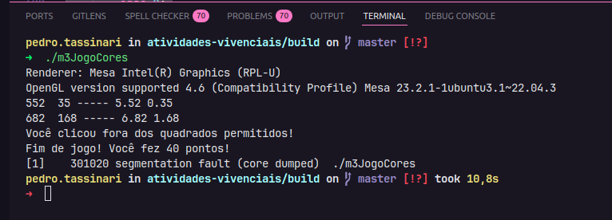
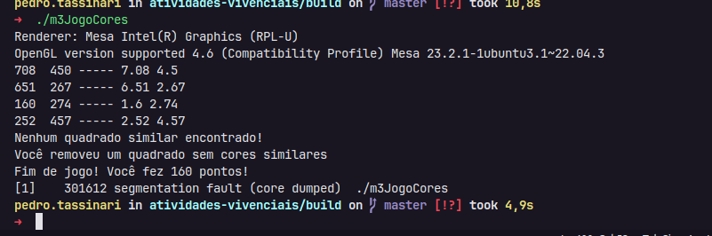
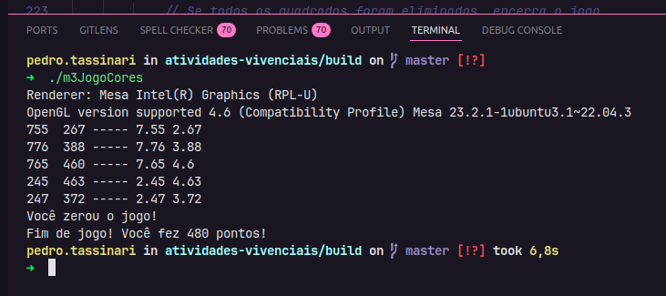

# Jogo das Cores

Este é um jogo feito em OpenGL e C++, baseado no que foi trabalhado em aula.

## Como funciona

O objetivo é eliminar todos os quadrados da tela. Para isso, o jogador deve clicar em um quadrado que tenha o **maior número possível de vizinhos com cores semelhantes**.

- Ao clicar, o quadrado e todos os que tiverem **cores com até 20% de similaridade** serão eliminados.
- Cada quadrado eliminado vale **10 pontos**.

## Quando o jogo termina

- Se **todos os quadrados forem eliminados** → o jogo termina com sucesso.
- Se o jogador **clicar em um espaço vazio** → o jogo termina.
- Se o jogador **clicar em um quadrado que não tem nenhum vizinho com cor parecida** → o jogo também termina.

As comparações de cor seguem a **mesma lógica usada nas aulas**.

No final, uma **mensagem é exibida no console** dizendo o que aconteceu.

